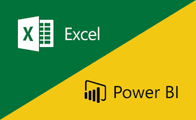
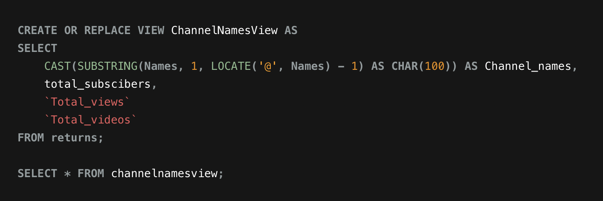
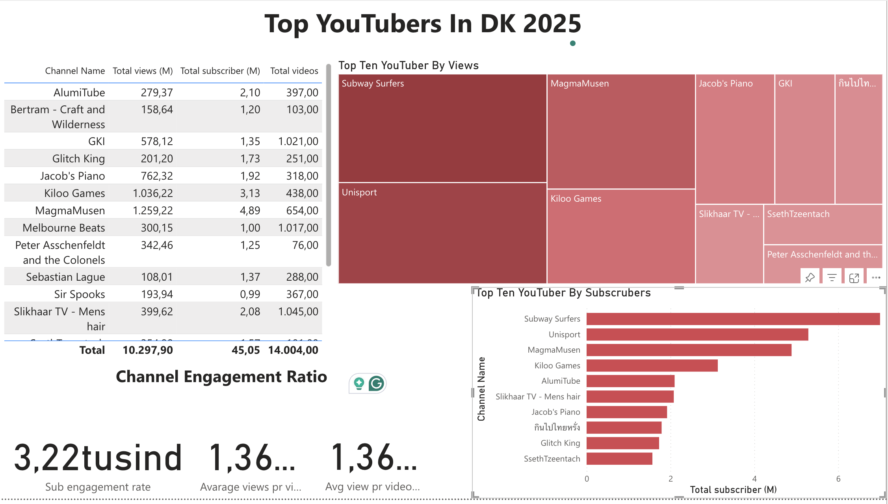
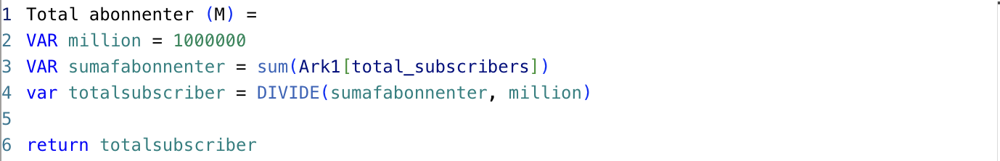
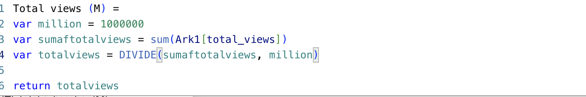
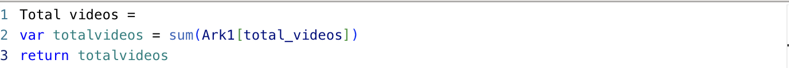
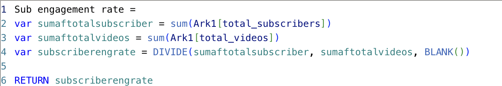
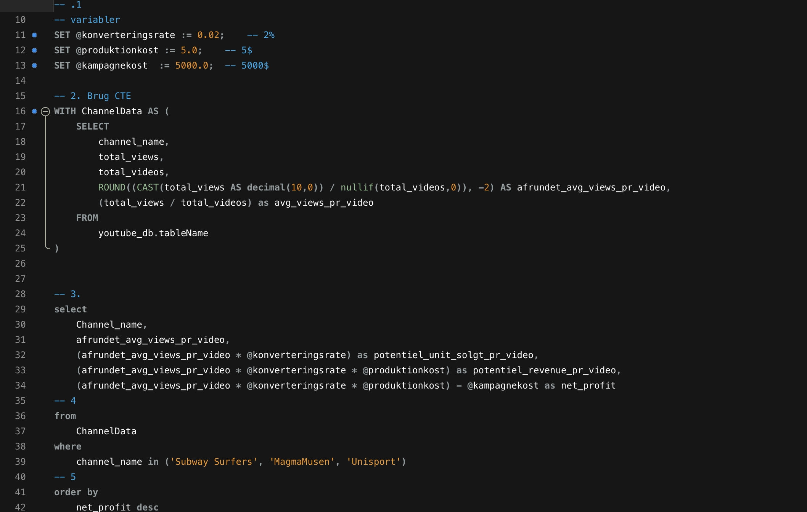
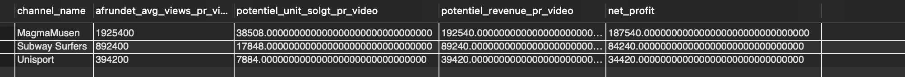

# Data portefølje - Fra Exel til PowerBI

## Litteraturliste

- [Formål](#Formål)
- [Data Kilder](#Data-kilder)
- [Design](#Design)
  - [Mock up](#Mock-up)
  - [Værktøjer](#Værktøjer)
- [Arbejdsproces](#Arbejdsproces)
  - [Kode](#Kode) 
  - [Data udtrækning](#Data-udtrækning)
  - [Data rensning](#Data-rensning)
  - [Data transformation](#Data-transformation)
  - [Opstillingen af MYSQL](#Opstillingen-af-MYSQL)
- [Visualisering](#Visualisering)
- [Power BI og DAX måling](#Power-BI-og-DAX-måling)
- [Analyse](#Analyse)
  - [Fund](#Fund)
  - [Validering](#Vildering)
  - [Udforskning](#Udforskning)
- [Anbefalinger](#Anbefalinger)
- [Konklusion](#Konklusion)
  - [Handlingsplan](#Handlingsplan) 

# Formål 

Formanden for Mærsks marketingsafdeling er interreseret i finde de 10 mest populære danske Youtubers i 2025. Med grundlag på at vide hvem, som egner sig bedst til at indgå en succesful kampagne med.

## User Story 

Som formand for Mærsks marketingsafdeling står Shannon med at finde den bedste YouTube-kanal, som vil være bedst at køre kampagner med. For at frembringe en god ROI. Du er blevet hyret som en ekstern konsulent til at indsamle, og identificere Danmarks største Youtubere, baseret på:

- Indsamle data om danske YouTubers.
- Identificere de største kanaler baseret på abonnenter, visninger og antal videoer.
- Bygge et dashboard, der giver indsigt i nøgletal og gør det let at filtrere og analysere resultaterne.

### Hvordan realisereres dette?

Dashboaded burde bestå af følgende:

-	En liste af de største Youtuberes baseret på antal visninger, antal abonnenter, og video opladede.
-	Illustrere nøgle metrics (kanal-navn, abonnenter, videoer, seer tal, engagement ratioer)
-	Være brugervenlig, og mulighed for at kunne filtrere
-	Bestå af de nyeste data

# Data Kilder

Følgende data indsamles fra hjemmesiden Kaggel:

- Kanal navn
- Abonnenenter
- Videoer
- Antal visninger

- Dataerne bliver hentet fra hjemmesiden Kaggel. Her et et extrakt af exel-filen : indsæt en fil

# Design 

## Krav til Dashboard

For at dashboaded succesfuldt kan opfylde formålet, skal følgende defineres:

1. Hvem er de 10 mest populære Youtubers i DK?
2. Hvilke 3 Youtubers har oplaoded flest videoer? 
3. Hvilke 3 har flest antal visninger?
4. Hvilke 3 har højst gennemsnitlige antal visninger pr. video?
5. Hvilke 3 har bedst forhold mellem visninger og abonnenter?
6. Hvilke 3 har den højeste engagementrate pr. video?

## Mockup og visualiering

Dashboaded er designet til at være visuelt overksueligt, og illustrere informationerne anstændigt. Følgende visuliserings-redskaber anvendes:

1. Table
2. Treemap
3. Scorecards
4. Horizontal bar chart

## Værktøjer

| Værktøj       | Formål     |
| ------------- |:-------------:|
|  Mockup     | Design af dashboardets wireframes|
| Excel    | Indledende dataudforskning |
| SQL | Datatransformation, rensning og test   |
| Power BI |  Visualisering via interaktive dashboards |
| GitHub | Dokumentation og versionsstyring |

# Arbejdsproces

Fremgangsmåden for at realisere projektet:

1. Indsamling af data
2. Dataanalyse i Excel
3. Indlæsning i SQL Server
4. Datatransformation og rensning med SQL
5. Datatest og validering (datatyper, og dubletter)
6. Visualisering i Power BI
7. Opstille fund og generingen af indsigter

## Dataudforskning 

- Vi har mindst fire centrale kolonner, der giver de nødvendige informationer (abonnenter, visninger, videoer, kanalnavn).
- Kanalnavne skal udtrækkes fra et ID-felt, hvor data er adskilt af “@”.
- Datasættet indeholder flere kolonner end nødvendigt, og unødvendige data bør fjernes.

## Datarensning 

Formålet er at sikre et klart og konsistent datasæt. Krav til rensede data, er som følgende:

1. Kun relevante kolonner beholdes
2. Konsistente og korrekte datatyper
3. Overskuelig struktur

Med følgende MYSQL syntakster kan vi realisere det:

#### Trin til datarensning

- Fjern irrelevante kolonner
- Udtræk kanalnavne fra første kolonne
- Omdøb kolonner med aliaser
- Transformér data

### Transformering af data 

### Opstilling af MYSQL View

# Visualisering 

Power BI dashboardet viser DK's top 10 YouTubers i 2025:

# Power BI og DAX måling

DAX-metrics defineret i Power BI inkluderer:

Totale abonnenter (i mio.)

Totale visninger (i mio.)

Totale videoer

Gennemsnitlige visninger pr. video (i mio.)

Engagementrate pr. abonnent

### få oversat målingerne korrek, dt er ikke sammenhængende!!!!

# Analyse

For at imødekomme chefen for marketingsafdelingens behov, skal følgende spørgesmål besvares:

Nøglespørgsmål:

Hvem er de 10 YouTubere med flest abonnenter?

| Nr.  | Kanal navne       | Antal abonnenter     |
| ----  | ------------- |:-------------:|
| 1.  |  Subway Surfers    | 9720000
| 2.  | Unisport    | 5290000 |
| 3.  | MagmaMusen | MagmaMusen |
| 4.  | Kiloo Games |  3130000 |
| 5.  | AlumiTube| 2100000|
| 6.  | Slikhaar TV - Mens hair | 2080000   |
| 7.  | Jacob's Piano |  1920000 |
| 8.  | กินไปไทยหรั่ง | กินไปไทยหรั่ง |
| 9.  | Glitch King|  1730000 |
| 10. | SsethTzeentach | 1570000|

Hvilke 3 kanaler har uploadet flest videoer?

| Nr.  | Kanal navne       | Antal videoer     |
| ----  | ------------- |:-------------:|
| 1.  |  Hyper Verse • MMD    | 12648  |
| 2.  | HLTVorg | 5089 |
| 3.  | Unisport | 3951 |

Hvilke 3 kanaler har flest visninger?

| Nr.  | Kanal navne       | Antal videoer     |
| ----  | ------------- |:-------------:|
| 1.  |  Subway Surfers  | 1670487976  |
| 2.  | Unisport | 1557580702 |
| 3.  | MagmaMusen | 1259217870 |

Hvilke 3 kanaler har højest gennemsnitlige visninger pr. video?

| Nr.  | Kanal navne       |  gennemsnitlige visninger (Millioner)    |
| ----  | ------------- |:-------------:|
| 1.  |  Peter Asschenfeldt and the Colonels  | 4,5  |
| 2.  | SsethTzeentach | 3,5 |
| 3.  | Jacob's Piano | 2,3 |

Hvilke 3 kanaler har højest abonnent-engagement pr. uploadet video?

| Nr.  | Kanal navne       |  abonnent-engagement (tusinde)    |
| ----  | ------------- |:-------------:|
| 1.  |  Peter Asschenfeldt and the Colonels  | 16.447 |
| 2.  | SsethTzeentach | 15.544|
| 3.  | Bertram - Craft and Wilderness | 11.650|

## Validering

##### MYSQL syntaks

# Youtuberes med flest abonnenter
   
####  Beregningsgennemgang:

A. Subway Surfers

Gennemsnitlige visninger pr. video = 890000.
Produktpris = 5 USD
Potentielt solgte enheder pr. video = 890000 × 2 % konverteringsrate =  17.800 enheder
Potentiel omsætning pr. video = 17.800 × 5 USD =  89.000 USD
Kampagneomkostning (engangsgebyr) = 50.000 USD
Nettofortjeneste = 89.000 – 50.000 = 894.000 USD

b. Unisport

Gennemsnitlige visninger pr. video = Unisport.
Produktpris = 5 USD
Potentielt solgte enheder pr. video = 390000. × 2 % konverteringsrate =  7.800 enheder
Potentiel omsætning pr. video =  7.800 × 5 USD = 39.000 USD
Kampagneomkostning (engangsgebyr) = 50.000 USD
Nettofortjeneste = 39.000 – 50.000 = - 11.000 USD

c. MagmaMusen

Gennemsnitlige visninger pr. video = 1,93 mio.
Produktpris = 5 USD
Potentielt solgte enheder pr. video = 1,93 mio. × 2 % konverteringsrate = 38600 enheder
Potentiel omsætning pr. video = 38600 × 5 USD =   193.000 USD
Kampagneomkostning (engangsgebyr) = 50.000 USD
Nettofortjeneste = 193.000 – 50.000 = 143.000 USD

MagmaMusen vurderes som bedste samarbejdspartner.

## Resultat

# Analyse – fund

### De vigtigste observationer:

MagmaMusen er den mest attraktive samarbejdspartner, da han kombinerer høj gennemsnitlig rækkevidde med et stort abonnenttal. Og leverer et stærkt ROI-potentiale.

# Handlingsplan
1. Starte dialog med MagmaMusens team om langsigtet partnerskab.
2. Forhandle kontrakter inden for budgetrammerne.
3. Lancere kampagner og måle performance op mod KPI’er.
4. Evaluere resultater, indsamle feedback, og optimere kampagnerne.

  

