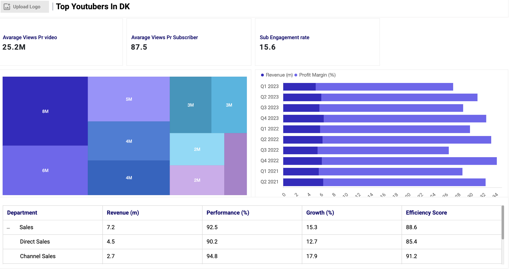

# Data portefølje - Fra Exel til PowerBI

##Billede skal være her 

## Litteraturliste

- [Formål](#Formål)
- [Data Kilder](#Data-kilder)
- [Design](#Design)
  - [Mock up](#Mock-up)
  - [Værktøjer](#Værktøjer)
- [Arbejdsproces](#Arbejdsproces)
  - [Kode](#Kode) 
  - [Data udtrækning](#Data-udtrækning)
  - [Data rensning](#Data-rensning)
  - [Data transformation](#Data-transformation)
  - [Opstillingen af MYSQL](#Opstillingen-af-MYSQL)
- [Data kvalitets tjek](#Data-kvalitets-tjek)
- [Visualisering](#Visualisering)
- [Power BI og DAX måling](#Power-BI-og-DAX-måling)
- [Analyse](#Analyse)
  - [Fund](#Fund)
  - [Validering](#Vildering)
  - [Udforskning](#Udforskning)
- [Anbefalinger](#Anbefalinger)
- [Konklusion](#Konklusion)

# Formål 
Formanden for Mærsks marketingsafdeling er interreseret i finde de 10 mest populære danske Youtubers i 2025. Med grundlag på at vide hvem, som egner sig bedst til at køre en succesful kampagne med.

## User Story 

Som formand for Mærsks marketingsafdeling står Shannon med opgaven til at finde den bedste YouTube-kanal, som vil være bedst at køre kampagner. For at frembringe en god ROI. Du er blevet hyret som en freelancer til at indsamle, og identificere Danmarks største Youtubere, baseret på antal visningerne, antal abonnenter, og video opladede.
### Hvordan realisereres dette?

Ved at opstille en dashboard som giver indsigt til i de 10 mest populære Youtubers i Danmark - Dashboaded burde bestå af følgende:

-	En liste af de største Youtuberes baseret på antal visninger, antal abonnenter, og video opladede.
-	Illustrere nøgle metrics (kanal-navn, abonnenter, videoer, seer tal, engagement ratioer)
-	Være brugervenlig, og let at kunne filtrere
-	Bestå af de nyeste data

# Data Kilder
Som nævnt tideligere skal følgende data indsamles:

- Kanal navn
- Abonnenenter
- Videoer
- Antal visninger

- Dataerne bliver hentet fra hjemmesiden Kaggel. Her et et extrakt af exel-filen : indsæt en fil

# Design 

## Krav for Dashboard

For at dashboaded succesfuldt kan bedst kan besvare formålet, skal følgende definere:

1. Hvem er de 10 mest populære Youtubers i DK?
2. Hvilke 3 youtubers har oplaoded flest videoer? 
3. Hvilke 3 har flest antal visninger?
4. Hvilke 3 har højst gennemsnitlige antal visninger pr. video?
5. Hvilke 3 har det bedste forhold mellem visninger og abonnenter?
6. Hvilke 3 har den højeste engegementrate pr. video?

## Dashboard mockup og visualieringer

Dashboaded bør være visuelt overksueligt, og kunne illustrere informationerne anstændigt. Følgende visuliserings redskaber kan anvendes:

1. Table
2. Treemap
3. Scorecards
4. Horizontal bar chart

## Værktøjer

Colons can be used to align columns.

| Værktøj       | Formål     |
| ------------- |:-------------:|
|  Mockup     | Design af dashboardets wireframes|
| Excel    | Indledende dataudforskning |
| SQL | Datatransformation, rensning og test   |
| Power BI |  Visualisering via interaktive dashboards |
| GitHub | Dokumentation og versionsstyring |

# Arbejdsproces

Tilgangen til at immødekomme formålet er som følgende:

1. Indsamling af data
2. Udforskning og første analyse i Excel
3. Indlæsning i SQL Server
4. Datatransformation og rensning med SQL
5. Datatest og validering (datatyper, og dubletter)
6. Visualisering i Power BI
7. Opstille fund og generingen af indsigter
8. Udarbejdelse af dokumentation
9. Udgive resultater på GitHub

## Dataudforskning 

- Vi har mindst fire centrale kolonner, der giver de nødvendige informationer (abonnenter, visninger, videoer, kanalnavn).
- Kanalnavne skal udtrækkes fra et ID-felt, hvor data er adskilt af “@”.
- Datasættet indeholder flere kolonner end nødvendigt, og unødvendige data bør fjernes.

## Datarensning 

Formålet er at sikre et klart og konsistent datasæt. Krav til rensede data, er som følgende:

1. Kun relevante kolonner beholdes
2. Konsistente og korrekte datatyper
3. Overskuelig struktur

Med følgende MYSQL syntakster kan vi realisere det:

   

  

