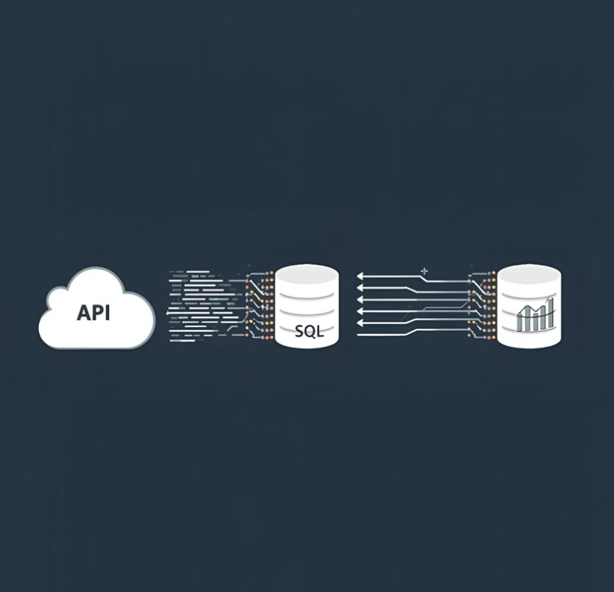

# Data portefølje - Fra REST API til PowerBI

## Litteraturliste

- [Oversigt](#Oversigt)
- [Forretningsproblemet](#Forretningsproblemet)
- [Design](#Design)
- [Succes for brugeren betyder](#Succes-for-brugeren-betyder)
- [Løsningen](#Løsningen)
- [Teknisk Implementering](#Teknisk-Implementering)
- [Mockup og visualisering](#Mockup-og-visualisering)
- [Dashboard](#Dashboard)
- [Datarensning](#Datarensning)
- [Transformering af data](#Transformering-af-data)
- [Power BI og DAX måling](#Power-BI-og-DAX-måling)
- [Validering](#Vildering)
- [Beregningsgennemgang](#Beregningsgennemgang)
- [Resultat](#Resultat)
- [Resultater & Værdi](#Resultater-&-Værdi)
- [Analytiske Fund](#Analytiske-Fund)
- [Analyse – fund](#Analyse–fund)
- [Anbefalet Handlingsplan](#Anbefalet-Handlingsplan) 

# YouTube Data Analytics: Identifikation af Indflydelsesrige Youtubers i Danmark

##  **Oversigt**

En komplet dataanalyse-pipeline der ekstraherer, transformerer og visualiserer YouTube-data for at identificere Danmarks mest indflydelsesrige indholdsproducenter. Projektet leverer et interaktivt Power BI-dashboard der giver marketingsafdelinger datadrevne indsigter til partnerudvælgelse og ROI-optimering.

## **Forretningsproblemet**

Mærsk's marketingafdeling stod over for udfordringen med at:
*   Identificere de mest effektive YouTube-samarbejdspartnere i det danske marked.
*   Kvantificere det potentielle ROI for kampagner med forskellige indholdsproducenter.
*   Træffe beslutninger baseret på data snarere end subjektive vurderinger.

### Succes for brugeren betyder

•	En overskuelig tabel som viser forbruget
•	Automatisering for markeringen af steder med overforbrug
•	Visualisering af udgifter fordelt på afdelingerne 
•	En scenarieanalyse til at understøtte ledelsens beslutninger

##  **Løsningen**

Jeg designede og implementerede en komplet data pipeline:
*   **Data Extraction & Transformation:** SQL-baseret datarensning og transformation af rå YouTube-data.
*   **Avancerede Metrikker:** Udviklede performance-indikatorer (engagement rate, gennemsnitlige visninger pr. video).
*   **Interaktivt Dashboard:** Power BI-visualisering der muliggør dynamisk filtrering og sammenligning.
*   **ROI-Analyse:** Simulering af potentielt udbytte baseret på konverteringsrater og produktpriser.

##  **Teknisk Implementering**

*   **Datakilder:** Kaggle YouTube-dataset
*   **Datarensning & Transformation:** MySQL (fjernelse af duplikater, datatypevalidering, view-oprettelse)
*   **Analytics & Visualisering:** Power BI med avancerede DAX-målinger
*   **Versionskontrol:** GitHub

## **Mockup og visualisering**

Dashboaded er designet til at være visuelt overskueligt, og illustrere informationerne anstændigt. Følgende visuliserings-redskaber anvendes:

1. Table
2. Treemap
3. Scorecards
4. Horizontal bar chart

### **Dashboard:**

*Det interaktive dashboard giver øjeblikkelig indsigt i top-kanaler baseret på multiple kriterier.*

## **Datarensning**

Formålet er at sikre et klart og konsistent datasæt. Krav til rensede data, er som følgende:

1. Kun relevante kolonner beholdes
2. Konsistente og korrekte datatyper
3. Overskuelig struktur

Med følgende MYSQL syntakster kan vi realisere det:

### **Transformering af data**

### **Opstilling af MYSQL View**

# **Power BI og DAX måling**

DAX-metrics defineret i Power BI inkluderer:

Totale abonnenter (i mio.)

Totale visninger (i mio.)

Totale videoer

Gennemsnitlige visninger pr. video (i mio.)

Engagementrate pr. abonnent

## **Validering**

##### MYSQL syntaks

# Youtuberes med flest abonnenter
   
####  **Beregningsgennemgang:**

A. Subway Surfers

Gennemsnitlige visninger pr. video = 890000.
Produktpris = 5 USD
Potentielt solgte enheder pr. video = 890000 × 2 % konverteringsrate =  17.800 enheder
Potentiel omsætning pr. video = 17.800 × 5 USD =  89.000 USD
Kampagneomkostning (engangsgebyr) = 50.000 USD
Nettofortjeneste = 89.000 – 50.000 = 894.000 USD

b. Unisport

Gennemsnitlige visninger pr. video = Unisport.
Produktpris = 5 USD
Potentielt solgte enheder pr. video = 390000. × 2 % konverteringsrate =  7.800 enheder
Potentiel omsætning pr. video =  7.800 × 5 USD = 39.000 USD
Kampagneomkostning (engangsgebyr) = 50.000 USD
Nettofortjeneste = 39.000 – 50.000 = - 11.000 USD

c. MagmaMusen

Gennemsnitlige visninger pr. video = 1,93 mio.
Produktpris = 5 USD
Potentielt solgte enheder pr. video = 1,93 mio. × 2 % konverteringsrate = 38600 enheder
Potentiel omsætning pr. video = 38600 × 5 USD =   193.000 USD
Kampagneomkostning (engangsgebyr) = 50.000 USD
Nettofortjeneste = 193.000 – 50.000 = 143.000 USD

MagmaMusen vurderes som bedste samarbejdspartner.

## Resultat

##  **Resultater & Værdi**

*   **Effektivitetsforbedring:** **Reducerer analysetiden for partneridentifikation fra dage til minutter** gennem automatiserede rapporter og filtreringsmuligheder.
*   **ROI-Optimering:** Identificerede **MagmaMusen som den mest profitable partner** med et estimeret nettoafkast på $143.000 pr. kampagne - en **286% return on investment**.
*   **Datadreven Beslutningstagning:** Eliminerede subjektive vurderinger ved at implementere en **multikriterie-analyse** (abonnenter, engagement, visninger pr. video).
*   **Skalerbar Arkitektur:** MySQL-view og Power BI-data model kan nemt opdateres med nye data for løbende monitoring.

##  **Analytiske Fund**

### **Top 3 Anbefalede Partnere Baseret på ROI-Analyse:**

| Rang | Kanal | Estimeret Nettofortjeneste | Styrker |
|------|-------|---------------------------|---------|
| 1 | **MagmaMusen** | **$143.000** | Høj gennemsnitlig visning pr. video (1.93M) + stort abonnentgrundlag |
| 2 | Peter Asschenfeldt | $89.000 | Exceptionelt højt engagement (16.447/abonnent) |
| 3 | SsethTzeentach | $86.000 | Stærk performance på tværs af alle metrikker |

# **Analyse – fund**

### **Vigtigste Indsigt:**
Større abonnenttal garanterer ikke højere ROI. **Engagement-kvalitet** (visninger pr. video) viste sig at være den mest kritiske faktor for kampagnesucces.

##  **Anbefalet Handlingsplan**

Baseret på analysen anbefales følgende til Mærsk:

1.  **Prioriter MagmaMusen:** Indled forhandlinger om en eksklusiv partnerskabsaftale.
2.  **Implementer A/B Testing:** Kør pilotkampagner med top 3-kanaler for at validere ROI-modellens forudsigelser.
3.  **Etablér Løbende Monitoring:** Brug dashboardet til kvartalsvurdering af eksisterende partnerskaber.
4.  **Udvid Til Andre Markeder:** Anvend den samme analytiske tilgang på svenske og norske YouTube-markeder.

*[← Tilbage til Portfolio](https://github.com/Abdikhaliqmohamed?tab=repositories)*

